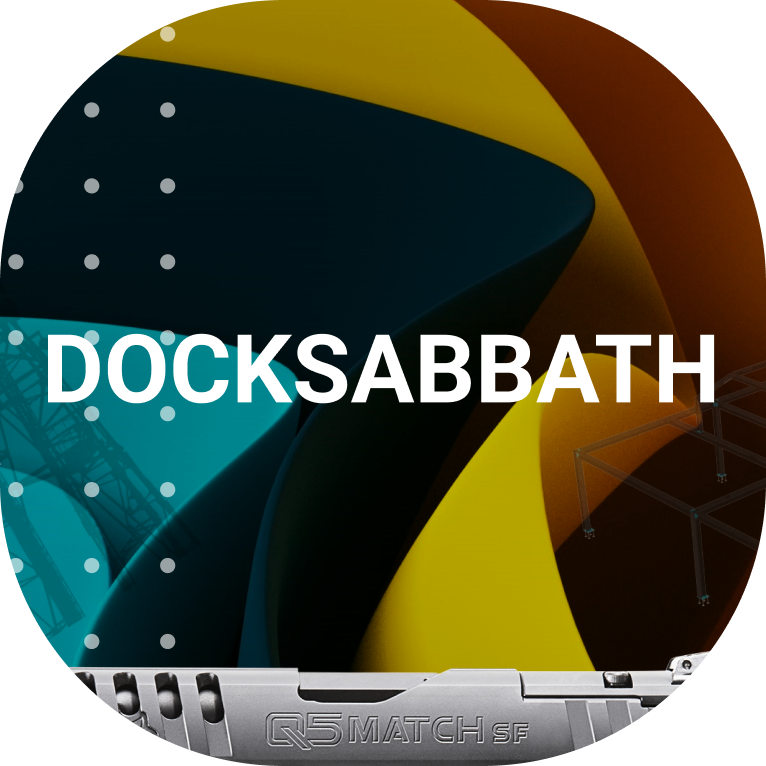

<h1 align="center">
   
  
   
  DockSabbath
   
</h1>

<h4 align="center">
kubectl  для тупых и нищих
</h4>

## Про DockSabbath
DockSabbath - это простой аналог kubectl с минимальным набором команд для удобного запуска. Приложение представляет собой оболочку для docker-compose и позволяет запускать несколько композов параллельно. Для удобства приложение может загружать последнюю версию ветки с гитхаба, деплоить её на сервер и запускать автоматически.

## Установка на Linux

Установите java

    wget https://download.oracle.com/java/21/latest/jdk-21_linux-x64_bin.deb
    sudo apt install ./jdk-21_linux-x64_bin.deb
    java --version

Скачивайте последний релиз и загрузите на сервер в удобную для вас папку.
Затем перейдите в папку и запустите приложение командой:

> java -jar DockSabbath-1.0-SNAPSHOT-jar-with-dependencies.jar -nogui
 
После первого запуска, приложение сгенерит токены для гита и клиентского апи. Что бы их посмотреть откройте файл config.json

## Использование
